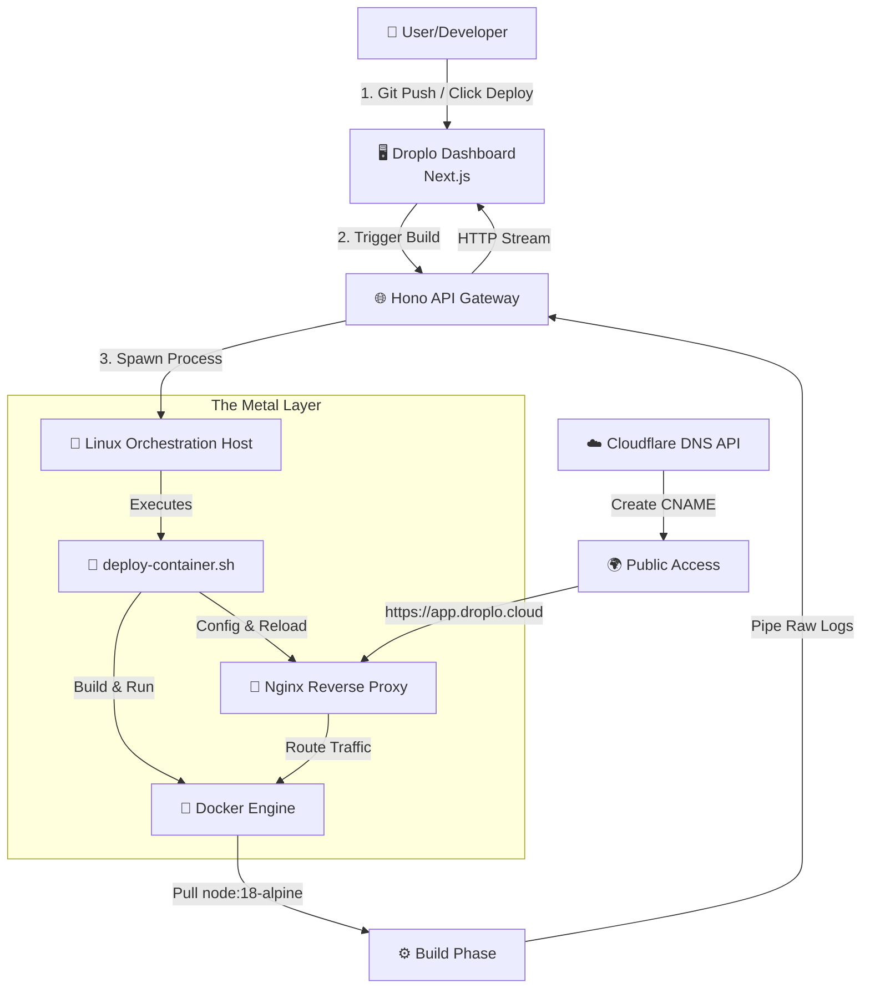

<div align="center">

# ☁️ Droplo Core

### Serverless Container Orchestration Engine

**Status:** Research Prototype / Engineering Case Study
**Domain:** droplo.cloud (Legacy)

</div>

---

Droplo is a custom Platform-as-a-Service (PaaS) engine designed to automate the deployment of Next.js applications. It reverse-engineers the core deployment pipeline of platforms like Vercel, utilizing Docker, Hono, Bash scripts, and Cloudflare to build, containerize, and route traffic to applications in real time.

Unlike standard CI/CD scripts, Droplo implements a **stateful build system** with live log streaming via HTTP chunked transfer encoding, giving users a real-time "Console" experience directly in the browser.

---

## 🏗️ System Architecture

The core engine operates as a bridge between the user’s Git repository and a raw Linux Docker host.



### Flow Overview

1.  **User (Developer)** → Git Push / Click Deploy
2.  **Droplo Dashboard** → Trigger Build
3.  **Hono API Gateway** → Spawn Process
4.  **Linux Orchestration Host**
    - `deploy-container.sh` (Bash)
    - Docker Engine (Build & Run Containers)
    - Nginx Configuration (`/etc/nginx`)
    - Nginx Service Reload
5.  **Docker Engine**
    - Pull base image (`node:18-alpine`)
    - Build user application image
    - Pipe raw binary logs back to Hono
6.  **Hono API Gateway**
    - Parse & sanitize stream
    - Forward logs as HTTP stream
7.  **Droplo Dashboard** → Render real-time build & deploy logs
8.  **Reverse Proxy (Nginx)** → Route traffic to container port
9.  **Cloudflare DNS API** → Create CNAME (`app-name.droplo.cloud`)
10. **Public Access** → `https://app-name.droplo.cloud`

---

## 🚀 Engineering Challenge: Streaming Builds

The critical challenge in building Droplo was handling **long-running Docker builds** (2–5 minutes) without blocking the main thread or timing out standard HTTP requests (which typically drop after ~60 seconds).

### Solution

- Used **Hono’s streaming context**
- Piped raw output from the Docker daemon socket directly to the frontend
- Maintained a single long-lived HTTP connection for the entire build lifecycle

---

## 🔧 Key Technical Implementations

### 1. In-Memory Context Generation

Instead of writing user code to disk (slow I/O), Droplo:

- Pulls the Git repository
- Injects `.env` variables
- Packs the Docker build context using `tar-stream`
- Sends the entire context to the Docker daemon **in RAM**

### 2. Heartbeat Mechanism

**Problem:** Load balancers (Cloudflare / Nginx) terminate idle TCP connections.

**Solution:**

- Implemented a `setInterval` heartbeat
- Sends empty bytes (`" "`) during silent build phases
- Keeps the HTTP connection alive during long `npm install` steps

### 3. Dynamic DNS Propagation

After a successful build:

- Calls the **Cloudflare DNS API**
- Creates a CNAME record (`app-name.droplo.cloud`)
- Enables instant SSL termination at the edge

---

## ⚙️ The "Metal" Layer: System Automation

While Node.js handles API orchestration, all critical infrastructure mutations are executed by privileged Bash scripts via `Bun.spawn`. This guarantees atomic, deterministic operations on the host machine.

### `deploy-container.sh` Responsibilities

**Container Lifecycle Management:**

- Detects containers running on the target port
- Gracefully stops and removes old containers (`docker stop` / `docker rm`)
- Launches the new container with strict resource limits

**Nginx Configuration Automation:**

- Generates a server block for the application subdomain
- Writes config to `/etc/nginx/sites-available/`
- Creates symlink in `sites-enabled/`
- Reloads Nginx without dropping active connections (`nginx -s reload`)

---

## 🧹 Log Sanitization & Stream Parsing

Docker’s daemon emits build logs as a continuous stream of buffered chunks. Often, multiple JSON objects are concatenated in a single chunk, which breaks standard JSON parsing.

To solve this, Droplo implements a robust stream parser that:

- Splits chunks by newline boundaries
- Filters empty buffers
- Sanitizes output with regex
- Normalizes Docker progress messages

### Core Parsing Logic

```typescript
export const formatStreamOutput = (chunk: Buffer): string[] => {
  const str = chunk.toString();
  const jsonObjects = str.split("\r\n").filter(Boolean);

  return jsonObjects
    .map((jsonStr) => {
      try {
        const data = JSON.parse(jsonStr);

        if (data.stream) {
          return data.stream
            .replace(/^\n+/, "")
            .replace(/---\u003e/, "-->")
            .trim();
        }

        if (data.status) {
          return data.progress
            ? `${data.status}: ${data.progress}`
            : data.status;
        }

        return "";
      } catch {
        return "";
      }
    })
    .filter(Boolean);
};
```

---

## 💻 Frontend Architecture & State Management

The frontend is implemented as a high-performance state machine that consumes a raw binary stream and converts it into a structured, real-time UI.

### 1. Stream Consumer (`useStreamHandler`)

To prevent UI “jank” during high-frequency log updates, the frontend uses the browser’s native `ReadableStream` API directly.

**Key principles:**

- Lock the stream reader
- Decode `Uint8Array` chunks incrementally
- Push updates into **Zustand** (outside React’s render cycle)
- Release the reader lock to prevent memory leaks

```typescript
const handleStream = useCallback(async (reader, phase) => {
  const textDecoder = new TextDecoder();

  try {
    while (true) {
      const { done, value } = await reader.read();
      if (done) break;

      const text = textDecoder.decode(value);

      phase === "build" ? updateBuildOutput(text) : updateDeployOutput(text);

      if (text.includes("error")) {
        throw new Error(`${phase} failed`);
      }
    }
  } finally {
    reader.releaseLock();
  }
}, []);
```

### 2. Orchestration Engine (`DeploymentManager`)

The logic layer that chains the entire lifecycle together:

- **Sequential pipeline:** Build → Parse Image ID → Deploy
- Regex-based extraction of container IDs from unstructured logs
- Execution time tracking per phase (`startTime` vs `endTime`)
- Performance reporting for observability

---

## 🛠️ Technology Stack

### Orchestration API

- **Hono**
- **Bun** (runtime)
- **Node.js Streams**

### System Scripting

- **Bash**
- **Linux utilities**

### Infrastructure

- **Docker Engine API** (dockerode)
- **Linux VPS**

### Networking

- **Cloudflare DNS API**
- **Nginx Reverse Proxy**

### Frontend

- **Next.js 14**
- **Zustand**
- **TailwindCSS**
- **shadcn/ui**

### Storage

- **UploadThing** (artifact caching)
- **PostgreSQL** (project metadata)

---

## ⚠️ Disclaimer & Status

This repository contains core architectural logic extracted from a private production codebase.

### Purpose

- Exploration of container orchestration
- Linux networking
- Real-time streaming systems

### Security Note

> **Warning:** `Bun.spawn` and Docker socket access run in privileged mode.

Production usage requires:

- **Rootless Docker**
- **Strict user namespacing**
- **Hardened isolation boundaries**

---

<div align="center">

**Author:** [Moaz El Gandy](https://github.com/moazelgandy)
_Building the tools I wish I had._

</div>
